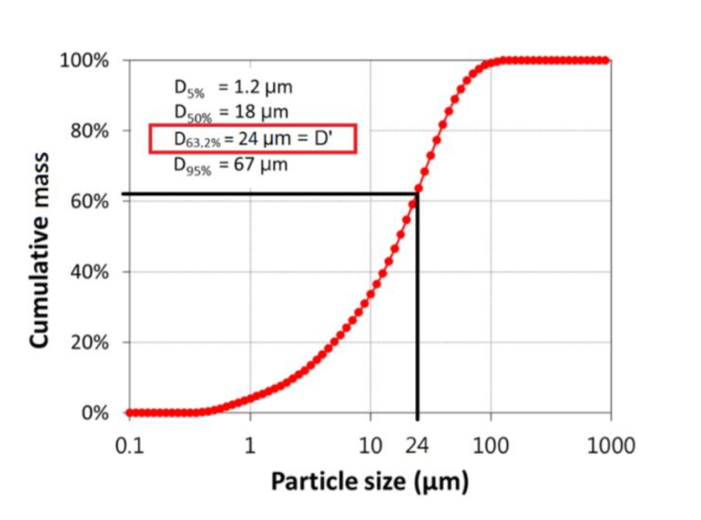

## Cement quantities

### Compressive strength

Cement strength is regulated by the European Standard EN 197. A distinction is made between three different strength classes, strengths of 32.5, 42.5 and 52.5 N/mm² after 28 days of hardening. The previously named values herby describe the minimum strength after 28 days, e.g. the minimum strength a cement in the class of 32.5 N/mm² may have after 28 days is 32.5 N/mm².

Generally, the cement strength is tested after 2, 7 and 28 days. For certain cement types (here: cement-type-1-52.5), the 7 day test is omitted and the 2 day strength is important because it is used for prefabricated concrete products. For usage in buildings, usually the 28 day-strength is the relevant one (here: cement-type-3-42.5).

Quantities:
* comp. str. 2d **important for cement-type-1-52.5**
* comp. str. 7d
* comp. str. 28d **important for cement-type-3-42.5**

### Particle size distribution (PSD)

The most important properties of the cement - water demand, solidification and strength development - are decisively influenced by the grinding fineness and particle size distribution of the main components of the cement. The general rule is: the finer the cement, the stronger it will be.

The particle size distribution is described in a cumulative manner (see Figure 1). Every point on the curve shows the percentage of particles (y-value) that is _smaller_ than a given size in μm (x-values). The values below are individual points on the curve at fixed percentages (e.g. `d50` - the median particle size - is fixed at 50%). One of these quantities is usually taken as a representative value for the fineness, here it is `d'`, which corresponds to 63.2%.

Quantities:
* d10
* d50
* d' **important**
* d84
* d90
* d95

### Chemical and structural analysis

The cement is further examined with X-ray fluorescence (XRF) and X-ray crystallography (XRC) techniques.

XRF is used to determine the elemental composition. The analyzers determine the chemistry of a sample by measuring the fluorescent (or secondary) X-ray emitted from a sample when it is excited by a primary X-ray source. Each of the elements present in a sample produces a set of characteristic fluorescent X-rays ("a fingerprint") that is unique for that specific element.

XRC resolves the atomic and molecular structure of a crystal, in which the crystalline structure causes a beam of incident X-rays to diffract into specific directions. By measuring the angles and intensities of these diffracted beams, a crystallographer can produce a three-dimensional picture of the density of electrons within the crystal. From the electron density, the mean positions of the atoms in the crystal can be determined, as well as their chemical bonds and crystallographic disorder.

XRF Quantities:
* CO2 **important**
* limestone content
* CaO
* MgO
* Al2O3
* SO3 **important**
* K2O
* Na2O
* Cl- **important**
* TiO2 **important**
* MnO
* S
* HS
* HS-XRF-sulfate-free
* Na2O-equiv.

XRC Quantities:
* C3S **important**
* C2S
* C3A-orthorhombic
* C3A-cubic
* C4AF
* unslaked lime
* calcite
* HS-XRC **important**

### Other quantities

There's a number of additional measurements that are performed in cement laboratories to ensure good product quality. Those are:

* reflectance L
* reflectance a
* reflectance b
* water-demand
* solidify-start
* solidify-end
* Le Chatelier
